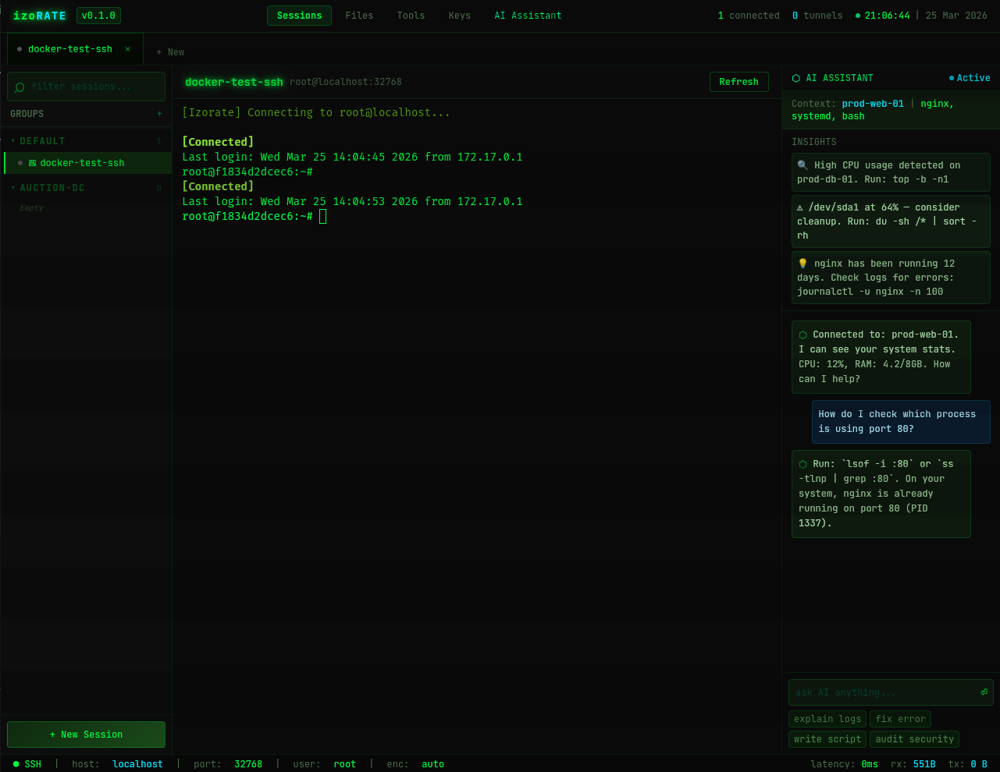

<p align="center">

</p>

<h1 align="center">IZORATE</h1>

<p align="center">
  <strong>The Cyberpunk-Infused AI-Native Connection Manager</strong>
  <br />
  <em>Experience the next evolution of SSH, SFTP, and Network Diagnostics.</em>
</p>

<p align="center">
  
  
  
  
</p>

---

## ⚡ Why Izorate?

Izorate is not just another terminal. It's a high-performance, cross-platform connection manager built with **Rust** and **Tauri**, designed for developers and sysadmins who demand speed, security, and a touch of modern cyberpunk aesthetics.

### 🤖 AI-Native Workflow
Stop searching for commands. Our integrated **AI Assistant** (supporting OpenAI, Anthropic, and Google Gemini) lives directly in your workspace.
- **Context Sanitization**: Automatically strip sensitive info (passwords, IPs) before sending context to AI.
- **Direct Terminal Injection**: Use `Ctrl + ]` to instantly send terminal output as context.

### 📡 Multi-Execution (Broadcasting)
Control your fleet from a single keyboard. Toggle **Multi-Exec mode** to broadcast your keystrokes across all active sessions simultaneously. Perfect for cluster management and rapid deployments.

### 🛡️ Enterprise-Grade Security
Your secrets never leave your machine. Izorate uses **AES-GCM-256** encryption to protect your SSH passwords, private keys, and API keys. The encryption key is uniquely derived from your hardware-id using **PBKDF2**.

### 🎨 CRT-Glow Aesthetics
Immerse yourself in a workspace that feels alive. High-contrast themes, subtle scanlines, and the iconic "Digital Green" CRT glow keep you focused during long-form reading and diagnostics.

---

## 🔥 Key Features

- **🌐 Cross-Platform**: Native performance on Windows, Linux, and macOS.
- **📁 Integrated SFTP**: Frictionless drag-and-drop file transfers with full unix permission management.
- **🔍 Network Toolbelt**: Built-in Ping, Traceroute, and Port Connectivity checks (using native Rust binaries).
- **🎥 Session Recording**: Capture your terminal sessions as lightweight video files for documentation or audit.
- **📋 Secure Clipboard**: Encrypted history of your terminal selections for quick retrieval.

---

## 🚀 Getting Started

### Prerequisites
- [Rust](https://www.rust-lang.org/)
- [Node.js](https://nodejs.org/)

### Installation
1. Clone the repository:
   ```bash
   git clone https://github.com/yourusername/izorate.git
   cd izorate
   ```
2. Install dependencies:
   ```bash
   npm install
   ```
3. Run in development mode:
   ```bash
   npm run tauri dev
   ```

---

## 🛠️ Tech Stack

- **Backend**: Rust (Tauri v2)
- **Frontend**: React, TypeScript, TailwindCSS
- **Communication**: Tauri Event Bus (Low-Latency)
- **Database**: SQLite (Stored Locally)
- **Cryptography**: AES-GCM (Hardware-Locked)

---

<p align="center">
  Made with 💚 and 🦀 by the community. 
  <br />
  <i>"Control the drift. Master the connection."</i>
</p>
